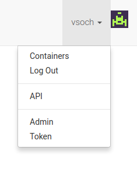
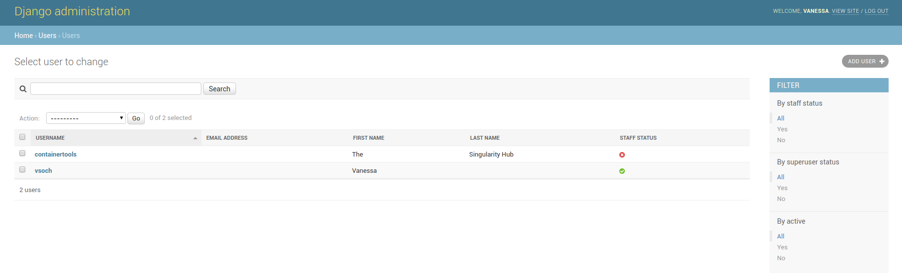
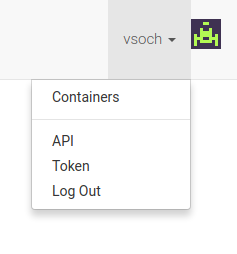
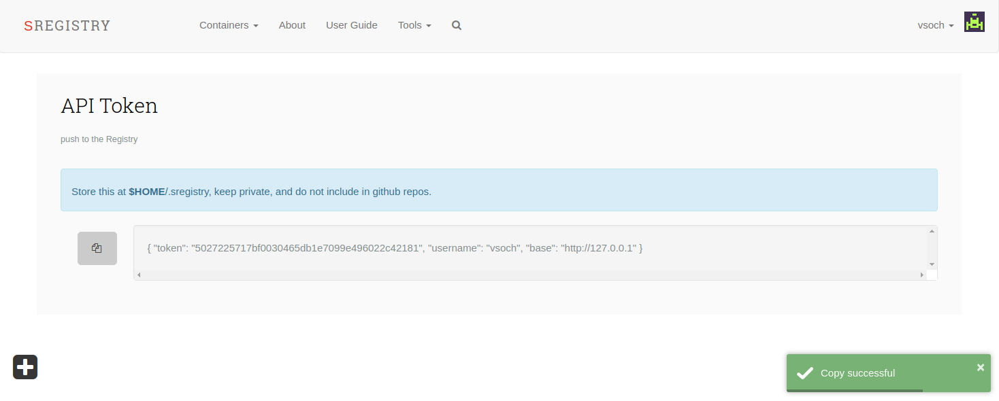

# Accounts

### User Accounts

If you remember from the [setup](../setup/teams#create-accounts) you created your first superuser account by giving permission to your account from the command line inside the container. For doing this again, you don't need to interact with the container in this way, but instead, you can manage admins (and other superusers) from the web interface. When logged in to your superuser account, you will see an "Admin" link in your profile in the top right:



This will take you to the administrative panel. Once there, you can click on "Users" at the bottom of the list, and then see a list of users to edit, with filters in the right panel.



Once you select a user, there will be checkboxes to give staff or superuser status, along with other options.


### Secrets

After you create a user, you will need a way to communicate to the registry, and validate your identity. This can be done by defining the `SREGISTRY_REGISTRY_BASE`, `SREGISTRY_REGISTRY_USERNAME` and `SREGISTRY_REGISTRY_TOKEN` environment variables. Each time we use the client, the secrets is used to encrypt a call and time-specific token that the registry can un-encrypt with the same key, and verify the payload. After creating your account in [setup](../setup/teams#create-accounts), making yourself a superuser and admin and logging in (remember this part?)

```bash
NAME=$(docker ps -aqf "name=sregistry_uwsgi_1")
docker exec $NAME python /code/manage.py add_superuser --username vsoch
docker exec $NAME python /code/manage.py add_admin --username vsoch
```

You will want to go to [http://127.0.0.1/token](http://127.0.0.1/token) and use the contents of the json object to define the necessary environment variables.



If you don't add yourself as an admin, the menu looks like this:


As an admin, you see the button for "token":



Here is the token page - note the button on the left will copy the text to your clipboard.



Define the following variables, by using the corresponding keys from the json object:

```bash
export SREGISTRY_REGISTRY_BASE=http://127.0.0.1
export SREGISTRY_REGISTRY_USERNAME=vsoch
export SREGISTRY_REGISTRY_TOKEN=5027225717bf0030465db1e7099e496022c42181
```

Now when we try to communicate with [the client](/sregistry-cli/client-registry), it finds the token and can identify us.

```bash
export SREGISTRY_CLIENT=registry
sregistry list
No container collections found.
```

Next, see if you are interested in activating any additional [plugins](../plugins) for your Singularity Registry Server.
