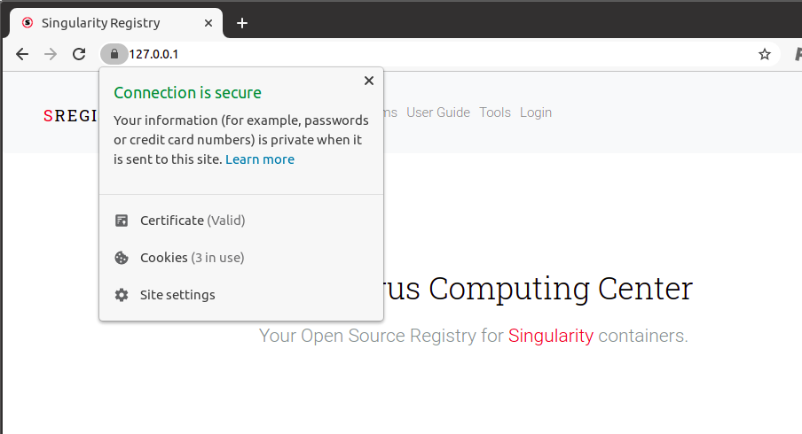

# Configure HTTPs

There are two strategies we discuss here to get https. The first is for development, meaning
you can make a faux https certificate to test it locally, and the second is for
production.

## Faux https

We are going to be using [FiloSottile/mkcert](https://github.com/FiloSottile/mkcert)
for this case. You can following the instructions in the README to generate your
"certificates." You will need [Go installed](https://golang.org/doc/install) on your system first.
If you want to install from a package manager, there are instructions in the
[repository README](https://github.com/FiloSottile/mkcert).

```bash
git clone https://github.com/FiloSottile/mkcert
cd mkcert
go build
```

I also needed to install:

```bash
$ sudo apt install libnss3-tools
```

So the certificates could be installed to my browsers.
This places `mkcert` in your current working directory!

```bash
$ ./mkcert -h
Usage of mkcert:

	$ mkcert -install
	Install the local CA in the system trust store.

	$ mkcert example.org
	Generate "example.org.pem" and "example.org-key.pem".

	$ mkcert example.com myapp.dev localhost 127.0.0.1 ::1
	Generate "example.com+4.pem" and "example.com+4-key.pem".

	$ mkcert "*.example.it"
	Generate "_wildcard.example.it.pem" and "_wildcard.example.it-key.pem".

	$ mkcert -uninstall
	Uninstall the local CA (but do not delete it).

For more options, run "mkcert -help".
```

I then did:

```bash
$ ./mkcert -install
The local CA is already installed in the system trust store! 👍
The local CA is now installed in the Firefox and/or Chrome/Chromium trust store (requires browser restart)! 🦊
```

Let's pretend we are generating a certificate for singularity-registry.org.

```bash
./mkcert singularity-registry.org "*.singularity-registry.org" singularity-registry.test localhost 127.0.0.1 ::1

Created a new certificate valid for the following names 📜
 - "singularity-registry.org"
 - "*.singularity-registry.org"
 - "singularity-registry.test"
 - "localhost"
 - "127.0.0.1"
 - "::1"

Reminder: X.509 wildcards only go one level deep, so this won't match a.b.singularity-registry.org ℹ️

The certificate is at "./singularity-registry.org+5.pem" and the key at "./singularity-registry.org+5-key.pem" ✅

It will expire on 29 August 2023 🗓
```

Then I moved them into the registry root, and updated my `shub/settings/local.py` to use
https on localhost.

```python
DOMAIN_NAME = "https://127.0.0.1"
DOMAIN_NAME_HTTP = "https://127.0.0.1"
DOMAIN_NAKED = DOMAIN_NAME_HTTP.replace("https://", "")
```

Finally, we need to make sure that we are using the docker compose file for https,
the nginx.conf for https, and that the certificates are correctly bound.

```bash
mv docker compose.yml docker compose.yml.http
mv https/docker compose.yml .
mv nginx.conf nginx.conf http
mv https/nginx.conf.https nginx.conf
```

In the docker compose.yml that is newly copied, change the binds of the
paths to use the files in your present working directory.

```yaml
nginx:
  restart: always
  image: quay.io/vanessa/sregistry_nginx
  ports:
    - "80:80"
    - "443:443"
  volumes:
    - ./nginx.conf:/etc/nginx/conf.d/default.conf:ro
    - ./uwsgi_params.par:/etc/nginx/uwsgi_params.par:ro
    - ./singularity-registry.org+5-key.pem:/code/domain.key
    - ./singularity-registry.org+5.pem:/code/cert.pem
#    - /etc/ssl/certs:/etc/ssl/certs:ro
#    - /etc/ssl/private:/etc/ssl/private:ro
```

We're almost done! In the newly moved nginx.conf, make sure to comment out the dhparam.pem,
the old certificate paths, and add the new ones we just created:

```
    ssl on;
#    ssl_certificate /etc/ssl/certs/chained.pem;
#    ssl_certificate_key /etc/ssl/private/domain.key;
    ssl_certificate /code/cert.pem;
    ssl_certificate_key /code/domain.key;
    ssl_session_timeout 5m;
    ssl_protocols TLSv1 TLSv1.1 TLSv1.2;
    ssl_ciphers ECDHE-RSA-AES256-GCM-SHA384:ECDHE-RSA-AES128-GCM-SHA256:DHE-RSA-AES256-GCM-SHA384:ECDHE-RSA-AES256-SHA384:ECDHE-RSA-AES128-SHA256:ECDHE-RSA-AES256-SHA:ECDHE-RSA-AES128-SHA:DHE-RSA-AES256-SHA:DHE-RSA-AES128-SHA;
    ssl_session_cache shared:SSL:50m;
#    ssl_dhparam /etc/ssl/certs/dhparam.pem;
    ssl_prefer_server_ciphers on;
```

You can then do `docker compose up -d`. As instructed by the tool, we probably
need to restart our browsers.

```bash
docker compose up -d
```

And amazingly (I opened Chrome freshly) my site has https!




Once you are done, you can (along with deleting the certs you created) you can
uninstall mkcert and delete the certs you created:

```bash
$ ./mkcert -uninstall
...
The local CA is now uninstalled from the system trust store(s)! 👋
```

You can see where the root certs were located:
 
```bash
$ ./mkcert -CAROOT
/home/vanessa/.local/share/mkcert
```

And remove them:

```bash
rm -rf  /home/vanessa/.local/share/mkcert/
```

I also deleted the mkcert directory and the original certificates,
and undid the changes above to settings, the docker compose and nginx.conf files

## Production https

### Get a hostname

Recall that the first step to get https is to have a hostname. You can use Google
Domains, or you can also create an account on [https://www.dynu.com](https://www.dynu.com) (It’s free).
Log into your account and under the Control Panel go to DDNS Services. On the next page, click the **+ Add** button, and fill out the Host and Top Level fields under Option 1 using whatever you like. 
This will be how users access your server (e.g., `sregistry.dynu.net)`. Click + Add.

 - On the next page, change the IPv4 Address to the IP address for your droplet. Change the TTL to 60. Click Save.
 - With a few minutes, you should be able to access your server using that hostname.

### Test Nginx

In the install script, we installed nginx. Now, you merely need to start it (it might
already be started).

```bash
$ sudo service nginx start
```

For this next step, we are still working on the host where you will run your container. What we first need to do is generate certificates, start a local web server, and ping "Let's Encrypt" to verify that we own the server, and then sign the certificates.

### SSL Certificates

We'll use "certbot" to install and renew certificates.

#### Step 1. Set some variables

First we'll set some variables that are used in later steps.

```bash
EMAIL="youremail@yourdomain.com"
DOMAIN="containers.page"
```

The email you set here will be used to send you renewal reminders at 20 days, 10 days, and 1 day before expiry (super helpful!)

#### Step 2. Install certbot

Certbot automates certificate generation and renewal. In other words, it makes it really easy to setup SSL.

```bash
sudo add-apt-repository ppa:certbot/certbot
sudo apt-get update
sudo apt-get install python-certbot-nginx
```

#### Step 3. Get certificates with certbot

Now obtain a certificate by running this command.  Note that if you aren't using a container, or you aren't the root user, you might need to add `sudo`.

```bash
certbot certonly --nginx -d "${DOMAIN}" -d "www.${DOMAIN}" --email "${EMAIL}" --agree-tos --redirect
```

Equivalently, if your domain doesn't have `www.` you can remove the second `-d` argument.

#### Step 4. Stop nginx

Now we need to stop nginx because we have what we need from it!

```bash
sudo service nginx stop
```

#### Step 5. Copy certs to a new location

Now we'll move the certs to where they're expected later.

```bash
sudo cp /etc/letsencrypt/live/$DOMAIN/fullchain.pem /etc/ssl/certs/chained.pem
sudo cp /etc/letsencrypt/live/$DOMAIN/privkey.pem /etc/ssl/private/domain.key
sudo cp /etc/letsencrypt/ssl-dhparams.pem /etc/ssl/certs/dhparam.pem
```

#### Step 6. Renewal (and remembering to renew!)

Certificates expire after 90 days. You'll get reminders at 20 days, 10 days, and 1 day before expiry to the email you set before. Before the cert expires, you can run this command to renew:

```bash
sudo certbot renew
```



The commands to stop the nginx container and
renew the certificates might look like this (this is for typical Ubuntu or similar).

```bash
docker compose stop nginx
sudo service nginx start
sudo certbot renew
sudo service nginx stop
docker compose start nginx
```

And then issue the command to start your container.

Importantly, when you start the container (that will be generated in the next steps)
you will need to bind to these files on the host, and
expose ports 80 and 443 too.
