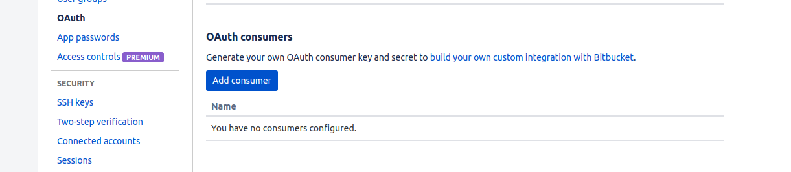

# Settings

See that folder called [settings](https://github.com/singularityhub/sregistry/blob/master/shub/settings)? inside are a bunch of different starting settings for the application. We will change them in these files before we start the application. There are actually only two files you need to poke into, generating a `settings/secrets.py` from our template [settings/dummy_secrets.py](https://github.com/singularityhub/sregistry/blob/master/shub/settings/dummy_secrets.py) for application secrets, and [settings/config.py](https://github.com/singularityhub/sregistry/blob/master/shub/settings/config.py) to configure your database and registry information.

## Secrets

There should be a file called `secrets.py` in the shub settings folder (it won't exist in the repo, you have to make it), in which you will store the application secret and other social login credentials.

An template to work from is provided in the settings folder called `dummy_secrets.py`. You can copy this template:

```bash
cp shub/settings/dummy_secrets.py shub/settings/secrets.py
```

Or, if you prefer a clean secrets file, create a blank one as below:

```bash
touch shub/settings/secrets.py
```

and inside you want to add a `SECRET_KEY`. You can use the [secret key generator](http://www.miniwebtool.com/django-secret-key-generator/) to make a new secret key, and call it `SECRET_KEY` in your `secrets.py` file, like this:

```      
SECRET_KEY = 'xxxxxxxxxxxxxxxxxxxxxxxxxxxxxxxxxxxxxxxxxxxxxxxxxxxx'
```

### Authentication Secrets

One thing I (@vsoch) can't do for you in advance is produce application keys and secrets to give your Registry for each social provider that you want to allow users (and yourself) to login with. We are going to use a framework called [python social auth](https://python-social-auth-docs.readthedocs.io/en/latest/configuration/django.html) to achieve this, and in fact you can add a [number of providers](http://python-social-auth-docs.readthedocs.io/en/latest/backends/index.html) (I have set up a lot of them, including SAML, so please <a href="https://www.github.com/singularityhub/sregistry/isses" target="_blank">submit an issue</a> if you want one added to the base proper.). Singularity Registry uses OAuth2 with a token--> refresh flow because it gives the user power to revoke permission at any point, and is a more modern strategy than storing a database of usernames and passwords. You can enable or disable as many of these that you want, and this is done in the [settings/config.py](https://github.com/singularityhub/sregistry/blob/master/shub/settings/config.py):


```python
# Which social auths do you want to use?
ENABLE_GOOGLE_AUTH=False
ENABLE_TWITTER_AUTH=False
ENABLE_GITHUB_AUTH=True
ENABLE_GITHUB_AUTH=False
ENABLE_GITLAB_AUTH=False
ENABLE_BITBUCKET_AUTH=False
```

and you will need at least one to log in. I've found that Github works the fastest and easiest, and then Google.
Twitter now requires an actual server name and won't work with localost, but if you are deploying on a server with a proper domain go ahead and use it. All avenues are extremely specific with regard to callback urls, so you should be very careful in setting them up. If you want automated builds from a repository
integration with Google Cloud Build, then you must use GitHub.

## Plugins

Other authentication methods, such as LDAP, are implemented as [plugins](https://singularityhub.github.io/sregistry/docs/plugins/) to sregistry. See the [plugins documentation](https://singularityhub.github.io/sregistry/docs/plugins/) for details on how to configure these. You should also now look here to see which plugins you will
want to set up (and then build into your container).

For authentication plugins, we will walk through the setup of each in detail here. 
For other plugins, you should look at the [plugins](https://singularityhub.github.io/sregistry/docs/plugins/) documentation now before proceeding. For all of the below, you should put the content in your `secrets.py` under settings. Note that if you are deploying locally, you will need to put localhost (127.0.0.1) as your domain, and Github is now the only one that worked reliably without an actual domain for me.

### Google OAuth2

You first need to [follow the instructions](https://developers.google.com/identity/protocols/OpenIDConnect) and setup an OAuth2 API credential. The redirect URL should be every variation of having http/https, and www. and not. (Eg, change around http-->https and with and without www.) of `https://www.sregistry.org/complete/google-oauth2/`. Google has good enough debugging that if you get this wrong, it will give you an error message with what is going wrong. You should store the credential in `secrets.py`, along with the complete path to the file for your application:

```python
GOOGLE_CLIENT_FILE='/code/.grilledcheese.json'

# http://psa.matiasaguirre.net/docs/backends/google.html?highlight=google
SOCIAL_AUTH_GOOGLE_OAUTH2_KEY = 'xxxxxxxxxxxxxxxxxxxxxx.apps.googleusercontent.com'
SOCIAL_AUTH_GOOGLE_OAUTH2_SECRET = 'xxxxxxxxxxxxxxxxx'
# The scope is not needed, unless you want to develop something new.
#SOCIAL_AUTH_GOOGLE_OAUTH2_SCOPE = ['https://www.googleapis.com/auth/drive']
SOCIAL_AUTH_GOOGLE_OAUTH2_AUTH_EXTRA_ARGUMENTS = {
    'access_type': 'offline',
    'approval_prompt': 'auto'
}
```

Google is great in letting you specify multiple acceptable callback urls, so you should set every version of `http://127.0.0.1/complete/google-oauth2` (I did with and without http/https, along with the ending and without the ending slash, just in case). Note that `1.` extra arguments have been added to ensure that users can refresh tokens, and `2.` in testing I was using `http` and not `https`, and I eventually added `https` (and so the url was adjusted accordingly). Next, we need to follow instructions for [web applications](https://developers.google.com/identity/protocols/OAuth2WebServer). 


### Setting up Github OAuth

For users to connect to Github, you need to [register a new application](https://github.com/settings/applications/new), and add the key and secret to your `secrets.py` file like this: 

```python
# http://psa.matiasaguirre.net/docs/backends/github.html?highlight=github
SOCIAL_AUTH_GITHUB_KEY = ''
SOCIAL_AUTH_GITHUB_SECRET = ''

# If you want to use the google_build plugin, you will need to include the following:
SOCIAL_AUTH_GITHUB_SCOPE = ["admin:repo_hook",
                            "repo:status",
                            "user:email",
                            "read:org",
                            "admin:org_hook",
                            "deployment_status"]
```

The callback url should be in the format `http://127.0.0.1/complete/github`, and replace the localhost address with your domain. See the [Github Developers](https://github.com/settings/developers) pages to browse more information on the Github APIs.


### Setting up Github Enterprise OAuth

The GitHub Exterprise [docs are here](https://python-social-auth.readthedocs.io/en/latest/backends/github_enterprise.html) and it looks like it uses the same backend as the regular GitHub, so you should not use both of these (meaning you should only have one set of environment variables export in your secrets for one or the other).  You will want to register a new application on your instance of GitHub Enterprise Developers, set the callback URL to "http://example.com/complete/github-enterprise/" replacing example.com with your domain, and then the following environment variables should be defined in your secrets.

```python
# The URL for your GitHub Enterprise appliance:
SOCIAL_AUTH_GITHUB_ENTERPRISE_URL = "https://git.example.com/"

# Set the API URL for your GitHub Enterprise appliance:
SOCIAL_AUTH_GITHUB_ENTERPRISE_API_URL = "https://git.example.com/api/v3/"

# Fill the Client ID and Client Secret values from GitHub in the settings:
SOCIAL_AUTH_GITHUB_ENTERPRISE_KEY = ""
SOCIAL_AUTH_GITHUB_ENTERPRISE_SECRET = ""
```

Again, do not also export environment variables for a regular GitHub application.

### Gitlab OAuth2

Instructions are provided [here](https://github.com/python-social-auth/social-docs/blob/master/docs/backends/gitlab.rst). Basically:

1. You need to [register an application](https://gitlab.com/profile/applications), be sure to add the `read_user` scope. If you need `api`, add it to (you shouldn't).
2. Set the callback URL to `http://registry.domain/complete/gitlab/`. The URL **must** match the value sent. If you are having issues, try adjusting the trailing slash or http/https/. 
3. In your `secrets.py` file under settings, add:

```
SOCIAL_AUTH_GITLAB_SCOPE = ['api', 'read_user']
SOCIAL_AUTH_GITLAB_KEY = ''
SOCIAL_AUTH_GITLAB_SECRET = ''
```
Where the key and secret are replaced by the ones given to you. If you have a private Gitlab, you need to add it's url too:

```
SOCIAL_AUTH_GITLAB_API_URL = 'https://example.com'
```


### Bitbucket OAuth2

We will be using the [bitbucket](https://python-social-auth.readthedocs.io/en/latest/backends/bitbucket.html) backend for Python Social Auth.

First, register a new OAuth Consumer by following the instructions in the [Bitbucket documentation](https://confluence.atlassian.com/bitbucket/oauth-on-bitbucket-cloud-238027431.html). Overall, this means registering a new consumer, and making sure to add the "account" scope to it. You can find the button to add a consumer in your BitBucket profile (click your profile image from the bottom left of [the dashboard](https://bitbucket.org/dashboard/overview).



After clicking the button, fill in the following values:

 - Name: choose a name that will be easy to link and remember like "Singularity Registry Server"
 - Callback URL: should be `http://[your-domain]/complete/bitbucket` For localhost, this is usually `http://127.0.0.1/complete/bitbucket`
 - Keep the button "This is a private consumer" checked.
 - Under Permissions (the scope) click on Account (email, read, write).


Then, when you click to add the consumer, it will take you back to the original pacge. To get the key and secret, you should click on the name of the consumer. Then add the following variables to your `secrets.py` file under settings:

```python
SOCIAL_AUTH_BITBUCKET_OAUTH2_KEY = '<your-consumer-key>'
SOCIAL_AUTH_BITBUCKET_OAUTH2_SECRET = '<your-consumer-secret>'
```

 3. Optionally, if you want to limit access to only users with verified e-mail addresses, add the following:

```python
SOCIAL_AUTH_BITBUCKET_OAUTH2_VERIFIED_EMAILS_ONLY = True
```

Finally, don't forget to enable the bitbucket login in settings/config.py:

```python
ENABLE_BITBUCKET_AUTH=True
```

### Setting up Twitter OAuth2
You can go to the [Twitter Apps](https://apps.twitter.com/) dashboard, register an app, and add secrets, etc. to your `secrets.py`:

```bash
SOCIAL_AUTH_TWITTER_KEY = ''
SOCIAL_AUTH_TWITTER_SECRET = ''
```

Note that Twitter now does not accept localhost urls. Thus, 
the callback url here should be `http://[your-domain]/complete/twitter`.


## Config

In the [config.py](https://github.com/singularityhub/sregistry/blob/master/shub/settings/config.py) you need to define the following:

### Google Analytics

If you want to add a Google analytics code, you can do this in the settings/config.py:

```python
GOOGLE_ANALYTICS = "UA-XXXXXXXXX"
```

The default is set to None, and doesn't add analytics to the registry.


### Domain Name
A Singularity Registry Server should have a domain. It's not required, but it makes it much easier for yourself and users to remember the address. The first thing you should do is change the `DOMAIN_NAME_*` variables in your settings [settings/config.py](https://github.com/singularityhub/sregistry/blob/master/shub/settings/config.py#L30).

For local testing, you will want to change `DOMAIN_NAME` and `DOMAIN_NAME_HTTP` to be localhost. Also note that I've set the regular domain name (which should be https) to just http because I don't have https locally:

```python
DOMAIN_NAME = "http://127.0.0.1"
DOMAIN_NAME_HTTP = "http://127.0.0.1"
#DOMAIN_NAME = "https://singularity-hub.org"
#DOMAIN_NAME_HTTP = "http://singularity-hub.org"
```

It's up to the deployer to set one up a domain or subdomain for the server. Typically this means going into the hosting account to add the A and CNAME records, and then update the DNS servers. Since every host is a little different, I'll leave this up to you, but [here is how I did it on Google Cloud](https://cloud.google.com/dns/quickstart).


### Registry Contact
You need to define a registry uri, and different contact information:

```python
HELP_CONTACT_EMAIL = 'vsochat@stanford.edu'
HELP_INSTITUTION_SITE = 'https://srcc.stanford.edu'
REGISTRY_NAME = "Tacosaurus Computing Center"
REGISTRY_URI = "taco"
```

The `HELP_CONTACT_EMAIL` should be an email address that you want your users (and/or visitors to your registry site, if public) to find if they need help. The `HELP_INSTITUTION_SITE` is any online documentation that you want to be found in that same spot. Finally, `REGISTRY_NAME` is the long (human readable with spaces) name for your registry, and `REGISTRY_URI` is a string, all lowercase, 12 or fewer characters to describe your registry.


### User Collections
By default, any authenticated user in your Registry can create collections, and decide to make them public or private. If you would prefer to revoke this permission (meaning that only administrators can create and manage collections) then you would want to set this variable to `False`.

```python
# Allow users to create public collections
USER_COLLECTIONS=True
```

Setting `USER_COLLECTIONS` to False also means that users cannot create [Teams](../setup/teams), which are organized groups of users that then can be added as contributors to individual collections. With this setting as True, any authenticated user, staff, or administrator can create and manage new collections and teams, and this is done by issuing a token.

Finally, you can also allow users to create collections, but limit the number created.

```python
# Limit users to N collections (None is unlimited)
USER_COLLECTION_LIMIT = None
```

The default is None, meaning that users can create unlimited collections, given that `USER_COLLECTIONS`
is True. If you set this to a non-zero positive integer, user collections will be limited to
this number. If a user is staff or an administrator, they are not subject to this limit.


### Registry Private
By default Singularity Registry will provide public images, with an option to set them to private. If you are working with sensitive data and/or images, you might want all images to be private, with no option to make public. You can control that with the variable `PRIVATE_ONLY`.

```python
PRIVATE_ONLY=True
```

The above would eliminate public status and make private the default. Alternatively, if you want to allow for public images but make the default private (and collection owners can make collections of their choice public) set `DEFAULT_PRIVATE` to True.

```python
DEFAULT_PRIVATE=True
```

`PRIVATE_ONLY` takes preference to `DEFAULT_PRIVATE`. In other words, if you set `PRIVATE_ONLY` to True, the default has to be private, the change to `DEFAULT_PRIVATE` is meaningless, and a user cannot change a collection to be public.


### Collections Page Display

On the main server's `<domain>/collections` page, users will be shown
some limited set of collections, plus those that are private that they own.
Since this could slow down the page if the number is huge, you are given
control of this number:

```python
# The number of collections to show on the /<domain>/collections page
COLLECTIONS_VIEW_PAGE_COUNT=250
```

For larger registries, it's recommended to disable this view all together, and
encourage users to find containers via "search." If you think this should
be a default, please open an issue to discuss.


### View Rate Limits

While it's unlikely someone would be malicious to request a view, we can't
disregard it completely. For all views, we use django-ratelimit to limit
views to a certain number per day based on the ip address. For most views,
you can define the variables:

```python
VIEW_RATE_LIMIT="50/1d"  # The rate limit for each view, django-ratelimit, "50 per day per ipaddress)
VIEW_RATE_LIMIT_BLOCK=True # Given that someone goes over, are they blocked for the period?
```

In the example above, we limit each ip address to 50/day. We block any addresses
that go over, until the next period begins.

### Container GET Limits

Too many get requests for any particular container, whether stored locally or in
Google Storage (Google Cloud Build + GitHub plugin) could lead to a DoS for the server.
Thus, we have a limit on the total number of weekly GET requests per container:

```python
# The maximum number of downloads allowed per container, per week
CONTAINER_WEEKLY_GET_LIMIT=100
```

The `Container` object has a get_limit and get_count that are adjusted when a
user downloads a container. A weekly cron job will reset the get_count.

### Collection GET Limits

It could be the case that a user continually rebuilds containers to get around the
single container get limit, in which case we've also added a collection
weekly get limit.

```python
# The maximum number of downloads allowed per collection, per week
COLLECTION_WEEKLY_GET_LIMIT=100
```

The `Collection` object also has a get_limit and get_count that are adjusted when a
user downloads a container, reset by the same cron task.


### Disable Building

Disable all building, including pushing of containers and recipes. By
default, for a working registry, this should be False.

```python
DISABLE_BUILDING=True
```

For other disable and limit arguments (for GitHub, creating, or receiving builds) see the
[Google Build Plugin](/sregistry/docs/plugins/google-build).

### Database

By default, the database itself will be deployed as a postgres image called `db`. You probably don't want this for production (for example, I use a second instance with postgres and a third with a hot backup, but it's an ok solution for a small cluster or single user. Either way, we recommend backing it up every so often.

When your database is set up, you can define it in your `secrets.py` and it will override the Docker image one in the `settings/main.py file`. It should look something like this

```python
DATABASES = {
    'default': {
        'ENGINE': 'django.db.backends.postgresql_psycopg2',
        'NAME': 'dbname',
        'USER': 'dbusername',
        'PASSWORD':'dbpassword',
        'HOST': 'localhost',
        'PORT': '5432',
    }
}
```

### Logging
By default, Singularity Registry keeps track of all requests to pull containers, and you have control over the level of detail that is kept. If you want to save complete metadata (meaning the full json response for each call) then you should set `LOGGING_SAVE_RESPONSES` to True. If you expect heavy use and want to save the minimal (keep track of which collections are pulled how many times) the reccomendation is to set this to False. 

```python
LOGGING_SAVE_RESPONSES=True
```

## API

Take a look in [settings/api.py](https://github.com/singularityhub/sregistry/blob/master/shub/settings/api.py)
to configure your restful API. You can uncomment the first block to require authentication:

```python
  'DEFAULT_PERMISSION_CLASSES': (
      'rest_framework.permissions.IsAuthenticated',
   ),
```

And also choose throttle rates for users and anonymous API requests.

```python
    # You can also customize the throttle rates, for anon and users
    'DEFAULT_THROTTLE_CLASSES': (
        'rest_framework.throttling.AnonRateThrottle',
    ),
    # https://www.django-rest-framework.org/api-guide/throttling/
    'DEFAULT_THROTTLE_RATES': {
        'anon': '100/day',
        'user': '1000/day',
    },
```

These are important metrics to ensure that your server isn't subject to a DoS attack.


Great job! Let's now [configure your web server and storage](server).
