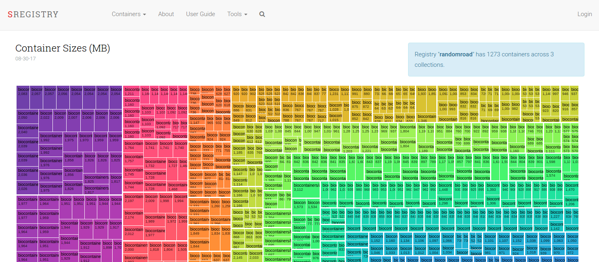

# Deployment
If starting from scratch, you need the following dependencies on the host:

 - [Docker](http://54.71.194.30:4111/engine/installation): a container engine
 - [docker-compose](http://54.71.194.30:4111/compose/install/): an orchestration tool for Docker images.
 - python: docker compose requires some additional python libraries, `ipaddress` and `oauth2client`

Very importantly, if you are just installing Docker *you will need to log in and out after adding your user to the Docker group*. 

For a record of the installation procedure that I used for a Google Cloud host, I've provided the [basic commands](../scripts/prepare_instance.sh). This script was run manually for an instance. This was done on a fairly large fresh ubuntu:16.04 instance on Google Cloud. This setup is done only once, and requires logging in and out of the instance after installing Docker, but before bringing the instance up with `docker-compose`. A few important points:

- The `$INSTALL_BASE` is set by default to `/opt`. It is recommended to choose somewhere like `/opt` or `/share` that is accessible by all those who will maintain the installation. If you choose your home directory, you can expect that only you would see it. If it's for personal use, `$HOME` is fine.
- Anaconda3 is installed for python libraries needed for `docker-compose`. You can use whatever python you with (system installed or virtual environment)
- Make sure to add all users to the docker group that need to maintain the application, and log in and out before use.


## Settings
See that folder called [settings](../shub/settings)? inside are a bunch of different starting settings for the application. We will change them in these files before we start the application. There are actually only two files you need to poke into, generating a [settings/secrets.py](../shub/settings/secrets.py) for application secrets, and [settings/config.py](../shub/settings/config.py) to configure your database and registry information.


### Secrets
There should be a file called `secrets.py` in the shub settings folder (it won't exist in the repo, you have to make it), in which you will store the application secret and other social login credentials.

An template to work from is provided `secrets.py.example`. You can copy this template:

```bash
cp shub/settings/secrets.py.example shub/settings/secrets.py
```

Or, if you prefer a clean secrets file, create a blank one as below:

```bash
touch shub/settings/secrets.py
```

and inside you want to add a `SECRET_KEY`. You can use the [secret key generator](http://www.miniwebtool.com/django-secret-key-generator/) to make a new secret key, and call it `SECRET_KEY` in your `secrets.py` file, like this:

```      
SECRET_KEY = 'xxxxxxxxxxxxxxxxxxxxxxxxxxxxxxxxxxxxxxxxxxxxxxxxxxxx'
```

### Authentication Secrets
One thing I (@vsoch) can't do for you in advance is produce application keys and secrets to give your Registry for each social provider that you want to allow users (and yourself) to login with. We are going to use a framework called [python social auth](https://python-social-auth-docs.readthedocs.io/en/latest/configuration/django.html) to achieve this, and in fact you can add a [number of providers](http://python-social-auth-docs.readthedocs.io/en/latest/backends/index.html) (I have set up a lot of them, including SAML, so please <a href="https://www.github.com/singularityhub/sregistry/isses" target="_blank">submit an issue</a> if you want one added to the base proper.). Singularity Registry uses OAuth2 with a token--> refresh flow because it gives the user power to revoke permission at any point, and is a more modern strategy than storing a database of usernames and passwords. You can enable or disable as many of these that you want, and this is done in the [settings/config.py](../shub/settings/config.py):

```
# Which social auths do you want to use?
ENABLE_GOOGLE_AUTH=False
ENABLE_TWITTER_AUTH=True
ENABLE_GITHUB_AUTH=False
ENABLE_GITLAB_AUTH=False

```

and you will need at least one to log in. I've found that Twitter works the fastest and easiest, and then Github and Google. All avenues are extremely specific with regard to callback urls, so you should be very careful in setting them up. 

Other authentication methods, such as LDAP, are implemented as [plugins](plugins.md) to sregistry.
See the [plugins documentation](plugins.md) for details on how to configure these.


 - [Github Developers](https://github.com/settings/developers)

We will walk through the setup of each in detail. For all of the below, you should put the content in your `secrets.py` under settings. Note that if you are deploying locally, you will need to put localhost (127.0.0.1) as your domain, and Twitter was the only one that worked reliably without an actual domain for me.


#### Google OAuth2
You first need to [follow the instructions](https://developers.google.com/identity/protocols/OpenIDConnect) and setup an OAuth2 API credential. The redirect URL should be every variation of having http/https, and www. and not. (Eg, change around http-->https and with and without www.) of `https://www.sregistry.org/complete/google-oauth2/`. Google has good enough debugging that if you get this wrong, it will give you an error message with what is going wrong. You should store the credential in `secrets.py`, along with the complete path to the file for your application:


      GOOGLE_CLIENT_FILE='/code/.grilledcheese.json'

      # http://psa.matiasaguirre.net/docs/backends/google.html?highlight=google
      SOCIAL_AUTH_GOOGLE_OAUTH2_KEY = 'xxxxxxxxxxxxxxxxxxxxxx.apps.googleusercontent.com'
      SOCIAL_AUTH_GOOGLE_OAUTH2_SECRET = 'xxxxxxxxxxxxxxxxx'
      # The scope is not needed, unless you want to develop something new.
      #SOCIAL_AUTH_GOOGLE_OAUTH2_SCOPE = ['https://www.googleapis.com/auth/drive']
      SOCIAL_AUTH_GOOGLE_OAUTH2_AUTH_EXTRA_ARGUMENTS = {
          'access_type': 'offline',
          'approval_prompt': 'auto'
      }


Google is great in letting you specify multiple acceptable callback urls, so you should set every version of `http://127.0.0.1/complete/google-oauth2` (I did with and without http/https, along with the ending and without the ending slash, just in case). Note that `1.` extra arguments have been added to ensure that users can refresh tokens, and `2.` in testing I was using `http` and not `https`, and I eventually added `https` (and so the url was adjusted accordingly). Next, we need to follow instructions for [web applications](https://developers.google.com/identity/protocols/OAuth2WebServer). 

#### Setting up Github OAuth
For users to connect to Github, you need to [register a new application](https://github.com/settings/applications/new), and add the key and secret to your `secrets.py` file like this: 


      http://psa.matiasaguirre.net/docs/backends/github.html?highlight=github
      SOCIAL_AUTH_GITHUB_KEY = ''
      SOCIAL_AUTH_GITHUB_SECRET = ''

      # You shouldn't actually need this if we aren't using repos
      # SOCIAL_AUTH_GITHUB_SCOPE = ["repo","user"]


The callback url should be in the format `http://127.0.0.1/complete/github`, and replace the localhost address with your domain. 


#### Gitlab OAuth2
Instructions are provided [here](https://github.com/python-social-auth/social-docs/blob/master/docs/backends/gitlab.rst). Basically:

1. You need to [register an application](https://gitlab.com/profile/applications), be sure to add the `read_user` scope. If you need `api`, add it to (you shouldn't).
2. Set the callback URL to `http://registry.domain/complete/gitlab/`. The URL **must** match the value sent. If you are having issues, try adjusting the trailing slash or http/https/. 
3. In your `secrets.py` file under settings, add:

```
SOCIAL_AUTH_GITLAB_SCOPE = ['api', 'read_user']
SOCIAL_AUTH_GITLAB_KEY = ''
SOCIAL_AUTH_GITLAB_SECRET = ''
```
Where the key and secret are replaced by the ones given to you. If you have a private Gitlab, you need to add it's url too:

```
SOCIAL_AUTH_GITLAB_API_URL = 'https://example.com'
```


#### Setting up Twitter OAuth2
Twitter is the easiest of the three to setup, you can go to the [Twitter Apps](https://apps.twitter.com/) dashboard, register an app, and add secrets, etc. to your `secrets.py`:

      SOCIAL_AUTH_TWITTER_KEY = ''
      SOCIAL_AUTH_TWITTER_SECRET = ''


The callback url here should be `http://127.0.0.1/complete/twitter`.


### Config
In the [config.py](../shub/settings/config.py) you need to define the following:


#### Domain Name
Singularity Registry should have a domain. It's not required, but it makes it much easier for yourself and users to remember the address. The first thing you should do is change the `DOMAIN_NAME_*` variables in your settings [settings/main.py](../shub/settings/main.py).

For local testing, you will want to change `DOMAIN_NAME` and `DOMAIN_NAME_HTTP` to be localhost. Also note that I've set the regular domain name (which should be https) to just http because I don't have https locally:

```
DOMAIN_NAME = "http://127.0.0.1"
DOMAIN_NAME_HTTP = "http://127.0.0.1"
#DOMAIN_NAME = "https://singularity-hub.org"
#DOMAIN_NAME_HTTP = "http://singularity-hub.org"
```

It's up to the deployer to set one up a domain or subdomain for the server. Typically this means going into the hosting account to add the A and CNAME records, and then update the DNS servers. Since every host is a little different, I'll leave this up to you, but [here is how I did it on Google Cloud](https://cloud.google.com/dns/quickstart).


#### Registry Contact
You need to define a registry uri, and different contact information:

```
HELP_CONTACT_EMAIL = 'vsochat@stanford.edu'
HELP_INSTITUTION_SITE = 'srcc.stanford.edu'
REGISTRY_NAME = "Tacosaurus Computing Center"
REGISTRY_URI = "taco"
```

The `HELP_CONTACT_EMAIL` should be an email address that you want your users (and/or visitors to your registry site, if public) to find if they need help. The `HELP_INSTITUTION_SITE` is any online documentation that you want to be found in that same spot. Finally, `REGISTRY_NAME` is the long (human readable with spaces) name for your registry, and `REGISTRY_URI` is a string, all lowercase, 12 or fewer characters to describe your registry.

#### Registry Private
By default Singularity Registry will provide public images, with an option to set them to private. If you are working with sensitive data and/or images, you might want all images to be private, with no option to make public. You can control that with the variable `PRIVATE_ONLY`.

```
PRIVATE_ONLY=True
```

The above would eliminate public status and make private the default. Alternatively, if you want to allow for public images but make the default private (and collection owners can make collections of their choice public) set `DEFAULT_PRIVATE` to True.

```
DEFAULT_PRIVATE=True
```

`PRIVATE_ONLY` takes preference to `DEFAULT_PRIVATE`. In other words, if you set `PRIVATE_ONLY` to True, the default has to be private, the change to `DEFAULT_PRIVATE` is meaningless, and a user cannot change a collection to be public.


#### Database
By default, the database itself will be deployed as a postgres image called `db`. You probably don't want this for production (for example, I use a second instance with postgres and a third with a hot backup, but it's an ok solution for a small cluster or single user. Either way, we recommend backing it up every so often.

When your database is set up, you can define it in your secrets.py and it will override the Docker image one in the settings/main.py file. It should look something like this

```python
DATABASES = {
    'default': {
        'ENGINE': 'django.db.backends.postgresql_psycopg2',
        'NAME': 'dbname',
        'USER': 'dbusername',
        'PASSWORD':'dbpassword',
        'HOST': 'localhost',
        'PORT': '5432',
    }
}
```

#### Visualizations
We show a nice treemap as one of the registry tools:



Also in this file you have the option to "tweak" this threshold of when we go from showing all containers (eg, specific tags) to just containers under collections. If this second approach is still too detailed, we may also make the fallback to just show collections.

```
########################################################################
# Visualizations
########################################################################

# After how many single containers should we switch to showing collections
# only? >= 1000
VISUALIZATION_TREEMAP_COLLECTION_SWITCH=1000
```

#### Logging
By default, Singularity Registry keeps track of all requests to pull containers, and you have control over the level of detail that is kept. If you want to save complete metadata (meaning the full json response for each call) then you should set `LOGGING_SAVE_RESPONSES` to True. If you expect heavy use and want to save the minimal (keep track of which collections are pulled how many times) the reccomendation is to set this to False. 

```
LOGGING_SAVE_RESPONSES=True
```

## Setup
Before doing `docker-compose up -d` to start the containers, there are some specific things that need to be set up.

### Under Maintenance Page
If it's ever the case that the Docker images need to be brought down for maintenance, a static fallback page should be available to notify the user. If you noticed in the [prepare_instance.sh](../scripts/prepare_instance.sh) script, one of the things we installed is nginx (on the instance). This is because we need to use it to get proper certificates for our domain (for https). Before you do this, you might want to copy the index that we've provided to replace the default (some lame page that says welcome to Nginx!) to one that you can show when the server is undergoing maintainance.

```bash
cp $INSTALL_ROOT/sregistry/scripts/nginx-index.html /var/www/html/index.html
rm /var/www/html/index.nginx-debian.html
```

If you don't care about user experience during updates and server downtime, you can just ignore this.

### Storage
The containers that you upload to your registry will be stored "inside" the Docker container, specifically at the location `/var/www/images`. By default, we map this location to the host in the base directory of `sregistry` in a folder called `images`. Equally, we map static web files to a folder named `static`. If you look in the [docker-compose.yml](docker-compose.yml) that looks something like this:


```
    - ./static:/var/www/static
    - ./images:/var/www/images
```

The line reads specifically "map `./images` (the folder "images" in the base directory sregistry on the host) to (`:`) the folder `/var/www/images` (inside the container). This means a few important things:

 - if you container goes away and dies, your image files do not. If the folder wasn't mapped, this wouldn't be the case.
 - when the container is running, since Docker is run as sudo, you won't be able to interact with the files without sudo either.

Thus, you are free to test different configurations of mounting this folder. If you find a more reasonable default than is set, please [let us know!](https://www.github.com/singularityhub/sregistry/issues).


### SSL
Getting https certificates is really annoying, and getting `dhparams.pem` takes forever. But after the domain is obtained, it's important to do. Again, remember that we are working on the host, and we have an nginx server running. You should follow the instructions (and I do this manually) in [generate_cert.sh](../scripts/generate_cert.sh). It basically comes down to:

 - starting nginx
 - installing tiny acme
 - generating certificates
 - using tinyacme to get them certified
 - moving them to where they need to be.
 - add a reminder or some other method to renew within 89 days

Once you have done this, you should use the `docker-compose.yml` and the `nginx.conf` provided in the folder [https](https). So do something like this:

```bash
mkdir http
mv nginx.conf http
mv docker-compose.yml http

mv https/docker-compose.yml $PWD
mv https/nginx.conf $PWD
```

Most importantly, we use a text file to make sure that we generate a single certificate that covers both www* and without. This part of the [generate_cert.sh](../scripts/generate_cert.sh) you will need to update the location (town, city, etc) along with your email and the domain you are using:

```bash
cat > csr_details.txt <<-EOF
[req]
default_bits = 2048
prompt = no
default_md = sha256
req_extensions = req_ext
distinguished_name = dn
 
[ dn ]
C=US
ST=California
L=San Mateo County
O=End Point
OU=SingularityRegistry
emailAddress=youremail@university.edu
CN = www.domain.edu
 
[ req_ext ]
subjectAltName = @alt_names
 
[ alt_names ]
DNS.1 = domain.edu
DNS.2 = www.domain.edu
EOF
```

Specifically, pay close attention to the fields in the last two sections that need to be customized for the domain and region.

If you run into strange errors regarding any kind of authentication / server / nginx when you start the images, likely it has to do with not having moved these files, or a setting about https in the [settings](../shub/settings). If you have trouble, please post an issue on the [issues board](https://www.github.com/singularityhub/sregistry/issues) and I'd be glad to help.


## Build the Image (Optional)
If you want to try it, you can build the image. Note that this step isn't necessary as the image is provided on [Docker Hub](https://hub.docker.com/r/vanessa/sregistry/). This step is optional - if you want to try building locally, you would do:


```bash
cd sregistry
docker build -t vanessa/sregistry .
```

## Compose the Images
Whether you build or not, the compose command will bring up the application (and download `vanessa/sregistry` image if not found in your cache).

```
docker-compose up -d
```

The `-d` means detached, and that you won't see any output (or errors) to the console. You can easily restart and stop containers, either specifying the container name(s) or leaving blank to apply to all containers. Note that these commands must be run in the folder with the `docker-compose.yml`:

```
docker-compose restart uwsgi worker nginx
docker-compose stop
```

When you do `docker-compose up -d` the application should be available at `http://127.0.0.1/`, and if you've configured https, `https://127.0.0.1/`. If you need to shell into the application, for example to debug with `python manage.py shell` you can get the container id with `docker ps` and then do:

```
NAME=$(docker ps -aqf "name=sregistry_uwsgi_1")
docker exec -it ${NAME} bash
```

If you make changes to the image itself, you will need to build again. However, if you just make changes to some static code, since it's mounted at `/code`, you can generally just restart:

```
docker-compose restart
```
Good job! Now it's time to read the [setup](setup.md) guide to better understand how to configure and interact with your Singularity Registry.
